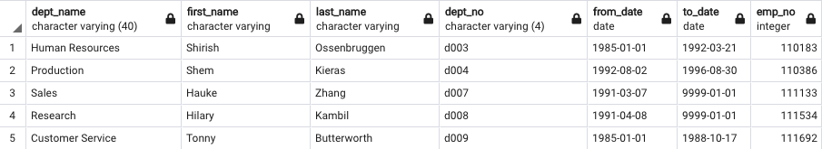
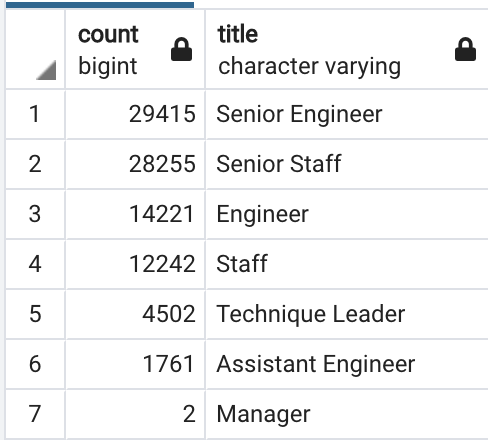

# Pewlett-Hackard-Analysis

## Overview of the Analysis:
Working with Pewlett-Hackard-Analysis I have created a series of queries and tables to understand which employees will most likely be retiring in the near future, and will need retirement packages. This information will be extremely useful for budgeting purposes and for HR to be prepared to fill roles as people leave. 

## Results: 
Here are some of the key findings from this analysis. They can all be found within new tables in our PH-EmployeeDB in Postgres, or exported as csv files. 
* A concise list of current employees at Pewlett Hackard
* A list of just current managers at Pewlett Hackard
* List of employees eligible for retirement 
* Total count of roles with employees eligible for retirement
* Employees who are eligible to participate in a mentorship program 

## Summary
Through these queries we can see:
1.  Pewlett Packard has 5 department managers at this time. Given that there are 9 departments, there are open department roles that can be filled. 

2. We can see which departments & roles will need to plan to hire due to retirement vacancies the most.

Looking at this table, we can see that Senior Engineers and Senior Staff have the most roles that will need to be potentially filled due to retirement. On the other hand, Managers only have 2 roles that may need to be fufilled due to retirement. However, that is due to the fact that there are significantly less manager roles to begin with. This count is based on current employees who were born between 1952 and 1955. 

3. We have generated a list of employees who qualify to participate in a mentorship program. These are employees that were born within the year of 1965. There are 1549 employees that qualify for a mentorship program. 

The key three take aways from this analysis can be found within the unique_titles, retiring_titles & mentorship_eligibility csv when addressing the two main questions in this project. Those questions being, which employees will need retirement packages, and what roles will need to be filled. The unique_titles csv contains a list of each employee who is eligible for retirement and may want packages. The retiring_titles, gives HR a general overview of which departments will be most impacted by retirement vacancies. Lastly, the mentorship_eligibility csv contains a list of employees that the company can benefit from by using them to mentor other, newer employees. 

